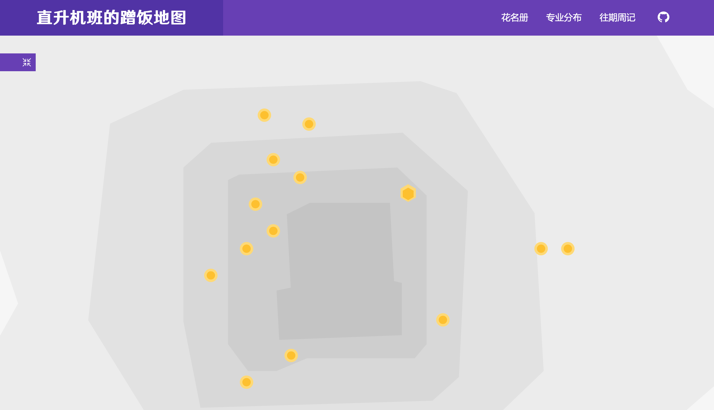
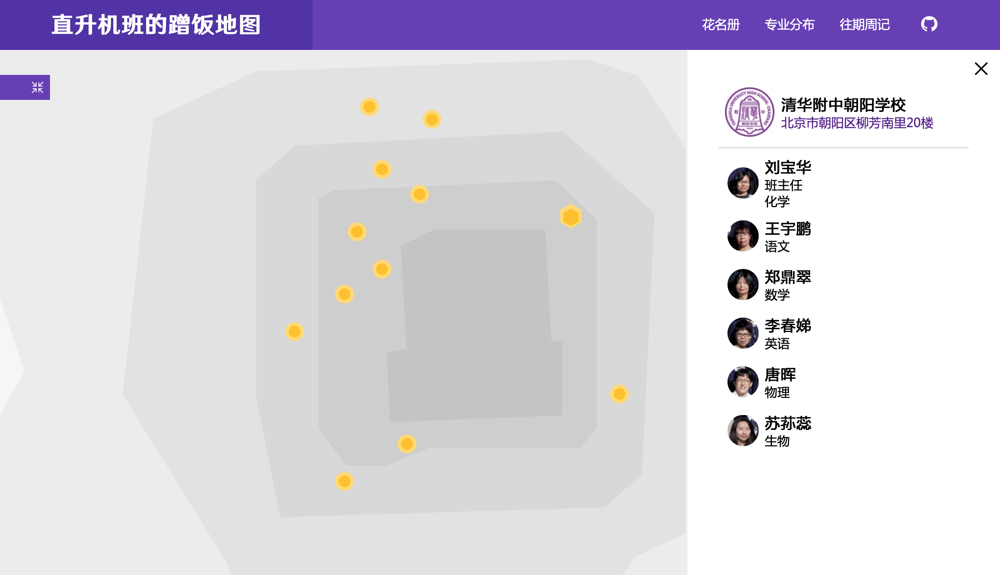
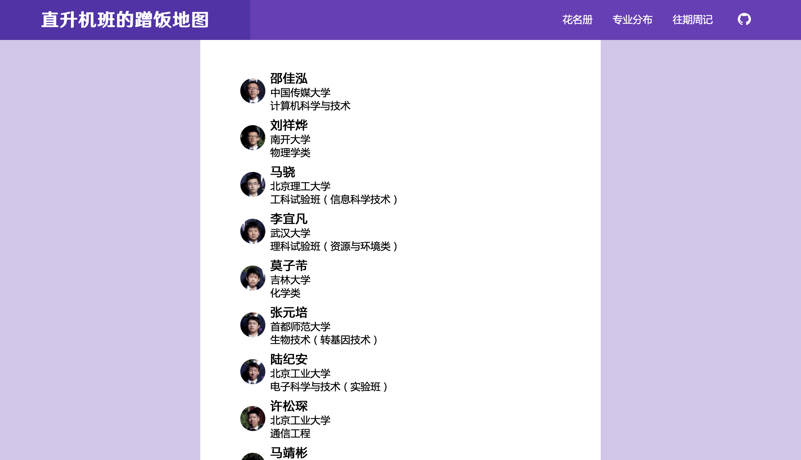

# SpongingMap
SpongingMap是清华附中朝阳学校2019届3班的蹭饭地图网站。

## 网址
* 码云 Pages: [https://clusravin.gitee.io/spongingmap/](http://clusravin.gitee.io/spongingmap/)  
* Github Pages: [https://martaincreature.github.io/SpongingMap/](https://martaincreature.github.io/SpongingMap/)

## 内容

### 地图

####方法
① 使用鼠标或触控板拖拽或滚动移动地图

② 单击左侧按钮移动到上一级地图（北京→中国→世界）

③ 单击学校地点查看信息

### 花名册

### 专业分布

### 往期周记
链接网站[ClassWeekly](http://clusravin.gitee.io/spongingmap/)